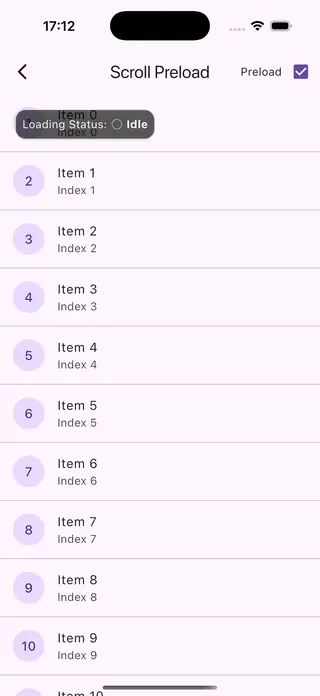

# Scroll Preload Detector

A Flutter widget designed to enhance user experience that listens to scroll notifications and triggers a preload callback when the user scrolls near the end of the content. This is a crucial component for implementing robust infinite scrolling or lazy loading patterns in your Flutter applications.

## Features

*   🚀 **Performance First**: Built on `NotificationListener`, avoiding expensive build cycles.
*   🎯 **Precise Control**: Configure `preloadDistance` to trigger loading exactly when needed.
*   🔄 **Smart Debouncing**: Prevents multiple load triggers while a request is already in progress.
*   🎛 **Flexible Configuration**: Supports custom scroll directions (`scrollDirection`) and specific axes (`axisDirection`).
*   🛡 **Control Flags**: Easily enable/disable detection or check `hasMore` data condition.

## Preview

| Enable Preload | Disable Preload |
| :---: | :---: |
|  |  |

## Getting started

Add this to your package's `pubspec.yaml` file:

```yaml
dependencies:
  scroll_preload_detector: ^0.0.1
```

## Usage

Wrap your ScrollView (like `ListView`, `GridView`, or `CustomScrollView`) with `ScrollPreloadDetector`.

```dart
import 'package:scroll_preload_detector/scroll_preload_detector.dart';

ScrollPreloadDetector(
  // Trigger loading when 600 pixels from the end
  preloadDistance: 600.0,
  
  // Your data loading logic
  preload: () async {
    await fetchMoreData();
  },
  
  // Check if there is more data to load to prevent unnecessary callbacks
  hasMore: () => hasMoreData,
  
  child: ListView.builder(
    itemCount: items.length,
    itemBuilder: (context, index) {
      return ListTile(title: Text('Item $index'));
    },
  ),
)
```

## Additional information

This package is designed to be lightweight and non-intrusive. It doesn't modify your ScrollView's physics or controller, making it compatible with other scroll libraries.
